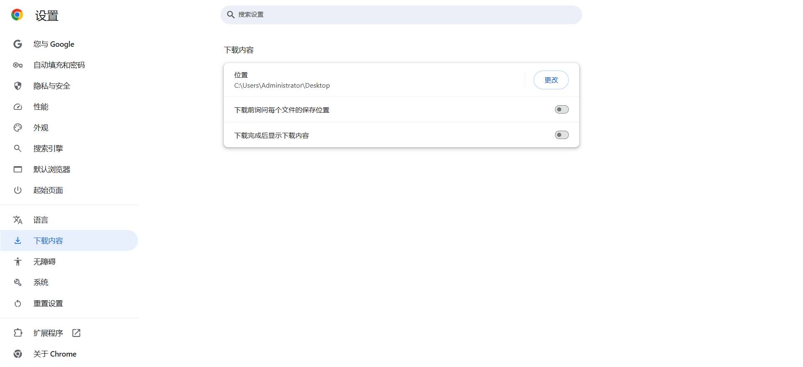

# My Video Recorder - Chrome 网页视频录制插件

一个功能强大的 Chrome 扩展，用于录制网页中的视频内容。支持多标签页选择、实时计时、异常处理等功能。

## 功能特性

### 🎯 核心功能

- **智能视频检测**：自动检测所有标签页中的 video 元素
- **多标签页选择**：支持从多个网页中选择要录制的视频
- **一键录制当前页**：快速录制当前标签页的视频
- **实时悬浮窗**：录制时显示可拖动的悬浮窗，包含计时器和停止按钮
- **自动保存**：网页异常关闭时自动保存录制内容

### 🎨 用户体验

- **动态图标切换**：未录制时显示红色正方形，录制时显示红色圆形
- **友好异常提示**：录制过程中的各种异常都有详细提示
- **智能文件命名**：使用网页标题 + 时间戳命名，避免重复
- **高帧率录制**：支持 30fps 高帧率录制，提升画质

### 🛡️ 稳定性保障

- **异常捕获**：关键逻辑用 try/catch 包裹，确保稳定性
- **状态监控**：监听 MediaRecorder 的 onerror、onpause、onresume 事件
- **自动清理**：录制结束后自动清理资源，避免内存泄漏

## 安装使用

### 1. 安装依赖

bash
npm install canvas

### 2. 生成图标

bash
node generate_icons.js

### 3. 加载扩展

1. 打开 Chrome 浏览器
2. 进入 chrome://extensions/
3. 开启"开发者模式"
4. 点击"加载已解压的扩展程序"
5. 选择项目根目录

### 4. 使用步骤

1. 打开包含视频的网页
2. 点击扩展图标
3. 选择"录制当前标签页"或从列表中选择要录制的页面
4. 录制开始后，页面右上角会出现悬浮窗
5. 点击悬浮窗的"停止"按钮或关闭页面即可保存视频

### 5.补充

，如图关闭，实现静默保存。

## 文件结构

My Video recorder/
├── manifest.json          # 扩展配置文件
├── background.js          # 后台脚本，处理图标切换和消息传递
├── content.js            # 内容脚本，实现录制逻辑和悬浮窗
├── popup.html            # 弹窗页面，用于选择录制目标
├── popup.js              # 弹窗脚本，检测可录制的标签页
├── generate_icons.js     # 图标生成脚本
├── icon_record_*.png     # 录制状态图标（16/32/48/128px）
├── icon_stop_*.png       # 停止状态图标（16/32/48/128px）
└── README.md             # 项目说明文档

## 技术实现

### 录制流程

1. **视频检测**：使用 document.querySelector('video') 检测页面中的视频元素
2. **流捕获**：通过 video.captureStream(30) 获取视频流
3. **录制处理**：使用 MediaRecorder API 录制视频流
4. **文件保存**：将录制的 Blob 数据保存为 webm 文件

### 异常处理

- **权限检查**：检测 MediaRecorder 和 captureStream 支持情况
- **状态监控**：监听录制过程中的错误、暂停、恢复事件
- **自动保存**：页面关闭时自动停止录制并保存文件

### 图标切换

- **未录制状态**：红色正方形图标
- **录制状态**：红色圆形图标
- **动态切换**：通过 chrome.action.setIcon 实现

## 配置说明

### manifest.json 关键配置

json
{
  "permissions": [
    "scripting",      // 脚本注入权限
    "activeTab"       // 当前标签页权限
  ],
  "host_permissions": [
    "<all_urls>"      // 所有网址权限
  ]
}

### 录制参数

javascript
const recorder = new MediaRecorder(stream, {
  mimeType: 'video/webm;codecs=vp9',    // 编码格式
  videoBitsPerSecond: 5_000_000         // 视频码率 5Mbps
});

## 维护说明

### 常见问题

#### 1. 扩展无法加载

- 检查 manifest.json 语法是否正确
- 确认所有必需文件都存在
- 查看 Chrome 扩展页面的错误信息

#### 2. 录制失败

- 确认页面包含 video 元素
- 检查浏览器是否支持 MediaRecorder
- 查看控制台是否有错误信息

#### 3. 文件无法保存

- 检查浏览器下载权限设置
- 确认磁盘空间充足
- 查看是否有安全软件阻止下载

#### 4. 录制画质不佳

- 调整 videoBitsPerSecond 参数
- 确保录制时页面处于前台
- 关闭其他高负载程序

### 开发调试

#### 查看日志

1. 打开 Chrome 开发者工具
2. 在 Console 面板查看错误信息
3. 在 Network 面板查看文件下载情况

#### 修改配置

- **录制参数**：修改 content.js 中的 MediaRecorder 配置
- **图标样式**：修改 generate_icons.js 中的绘制逻辑
- **界面样式**：修改 popup.html 和悬浮窗的 CSS

#### 添加功能

1. 在 content.js 中添加新的录制功能
2. 在 popup.js 中添加新的检测逻辑
3. 在 background.js 中添加新的消息处理

### 版本更新

#### 更新步骤

1. 修改代码文件
2. 重新生成图标（如需要）
3. 在 Chrome 扩展页面点击"重新加载"
4. 测试新功能

#### 发布准备

1. 压缩项目文件
2. 更新 manifest.json 中的版本号
3. 准备扩展描述和截图
4. 提交到 Chrome Web Store

## 技术限制

### 浏览器兼容性

- **Chrome 66+**：完全支持
- **Edge 79+**：基本支持
- **Firefox**：部分功能可能不兼容
- **Safari**：不支持

### 录制限制

- **DRM 视频**：无法录制加密内容
- **Canvas 视频**：无法录制 WebGL 渲染的视频
- **跨域限制**：无法录制 iframe 中的视频（除非同源）

### 性能考虑

- **长时间录制**：可能占用大量内存
- **高分辨率**：对 CPU 要求较高
- **多标签页**：同时录制多个页面会显著影响性能

## 更新日志

### v2.1.0

- ✅ 修复悬浮窗计时器不更新的问题
- ✅ 优化分段录制功能
- ✅ 改进错误处理机制
- ✅ 提升录制稳定性

## 许可证

本项目仅供学习和个人使用，请遵守相关法律法规和网站服务条款。

## 贡献

欢迎提交 Issue 和 Pull Request 来改进这个项目！

---

**注意**：使用本插件录制视频时，请确保遵守相关法律法规和网站服务条款，不要录制受版权保护的内容。
